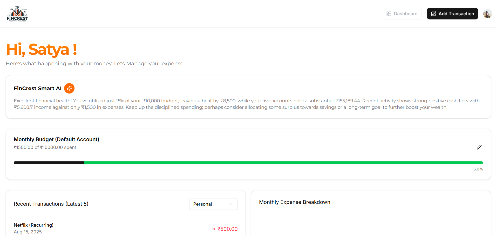

💰 FinCrest – Smart AI Budget Tracker 



**FinCrest** is a **full-stack, AI-powered budget tracking application** that helps users manage accounts, track transactions, and gain **real-time AI-driven financial insights**.  

🔗 [Live Demo](https://fincrest.fun) | 📖 [Full Documentation](./docs/README.md)

---

✨ Features
- 📊 **AI-Powered Dashboard** – Real-time spending insights & budget health  
- 🧾 **Smart Receipt Scanner** – Auto transaction entry using Gemini AI  
- 💡 **Budget Planning & Alerts** – Alerts at 80% budget usage  
- 🏦 **Multi-Account Support** – Manage multiple accounts & defaults  
- 🔍 **Transaction Management** – Filter, sort, bulk delete, recurring flags  
- 🔒 **Security** – Rate limiting & bot protection with Arcjet  
- 📧 **Automated Emails** – Monthly summaries & overspending alerts  

---

🛠️ Tech Stack
**Frontend:** React, Next.js, TypeScript, Tailwind CSS, shadcn/ui  
**Backend:** Next.js API Routes, Supabase, Prisma  
**AI & Integrations:** Gemini AI, Arcjet, Inngest, Resend  
**Auth:** Clerk  
**Deployment:** Vercel (Phase 1), Azure VM + Pipelines (Phase 2)  

---

## 🚀 Getting Started

1. Clone the repo
```bash
git clone https://github.com/satyachandu11/fincrest.git
cd fincrest

2. Install dependencies
npm install
# or
yarn install

3. Set up environment variables

Create a .env.local file and configure the following:

NEXT_PUBLIC_SUPABASE_URL=
NEXT_PUBLIC_SUPABASE_ANON_KEY=
CLERK_PUBLISHABLE_KEY=
CLERK_SECRET_KEY=
GEMINI_API_KEY=
ARCJET_KEY=
RESEND_API_KEY=

4. Run the development server
npm run dev


Visit: http://localhost:3000